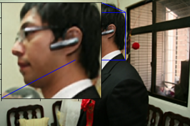

# Images Resolution Enhancement Usiung CNN

<table>
  <tr>
    <td>
     
    </td>
    <td>
     
    </td>
  </tr>
</table>

Image quality has seen great improvement in recent years due to the evolution in the equipment used to capture images. In early 2000s, the standard resolution was (800x600), while at this moment, the standard resolution is (1920x1080) with monitors being able to provide 4K resolution (3840x2160). However, more resolution means more size; meaning that the image will take more space the higher the quality of it. 

To avoid this problem as much as possible, many solutions have been suggested which aim to lower the size of the image while keeping the quality of it intact. The most popular solution is Image Compression. Image compression is the process of encoding or converting an image file in such a way that it consumes less space than the original. file. Image compression is typically performed through an algorithm or codec which specifies all similarly colored pixels by the color name, code, and the number of pixels. This way one pixel can correspond to hundreds or thousands of pixels.

While image compression is used to reduce the size of the image with no loss in quality, that is not always the case. Sometimes, image compression is not perfect and some quality will be lost. Even though this loss might be small compared to the benefit of the size reduction, repeating this process many times will eventually lead to bad image quality. There are also other operations performed on images which reduce the quality of images, such as zooming and screenshots.

This project aims to enhance the quality of low-resolution images by mainly focusing on sharpening the edges of colors in the image; making them sharp and distinctly better quality with some improvement in the overall quality of the image. This will be achieved through Deep Learning. Deep Learning is a subset of Machine Learning, which is essentially a neural network. These neural networks attempt to simulate the behavior of the human brain; allowing it to learn from large amounts of data.

The idea of this project is to take low-resolution images and improve their quality. To do so, a model must be built that is capable of extracting the resolution-enhancing features and low-resolution images must be fed to this model so it can be trained. Before feeding the images into the model, images will be preprocessed to prepare them for the model. After training our model, we will check the results through a validation process.

This project is inspired by [ESPCN Paper](https://arxiv.org/abs/1609.05158), where the idea of upscaling the images from low-resolution to high-resolution first appeared. The implementation has been optimized by adding additional layers (such as RDBs) and some hyperparameters were tinkered with in order to achieve better results.

## Requirements
- [Anaconda](https://www.anaconda.com/download/)
- Required packages found in Requirements.txt
```
pip install -r requirements.txt
```

## Datasets

The train and val datasets are sampled from [ImageNet](https://www.image-net.org/download.php).

ImageNet dataset contains more than 1,500,000 images. A portion of 100,000 images were taken from the ImageNet dataset, where they were filtered and 65,296 remained, 50,000 were used for training and 15,296 for validation.

You can download the datasets from [here](https://www.kaggle.com/competitions/imagenet-object-localization-challenge/data).

## Results

Here, we can notice the difference in quality between a low-resolution image and an enhanced-resolution image.

**Upscale Factor = 3**

> Result #1

<table>
  <tr>
    <td>
     
    </td>
    <td>
     
    </td>
  </tr>
</table>

> Result #2

<table>
  <tr>
    <td>
     
    </td>
    <td>
     
    </td>
  </tr>
</table>

> Result #3

<table>
  <tr>
    <td>
     
    </td>
    <td>
     
    </td>
  </tr>
</table>

> Result #4

<table>
  <tr>
    <td>
     
    </td>
    <td>
     
    </td>
  </tr>
</table>

## Note: If you can't display the Jupyter Notebook, you can do so [here](https://nbviewer.org/github/ahmadsallakh/Images-Resolution-Enhancement-Usiung-CNN/blob/main/Images%20Resolution%20Enhancement%20Using%20CNN.ipynb).
